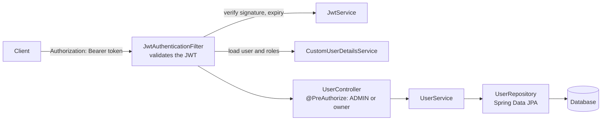
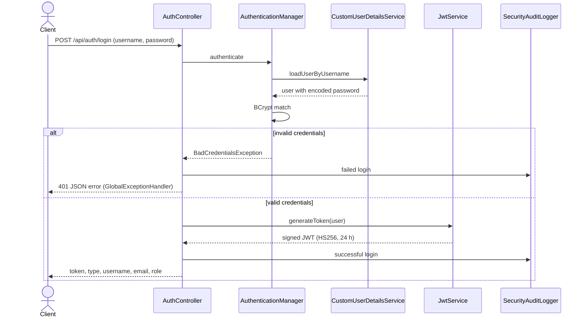

# spring-boot-auth-template

[](https://github.com/ClaudioPaulo/spring-boot-auth-template/actions/workflows/ci.yml)

A Spring Boot 3 starter for JWT authentication and role-based user management, built with Java 17. Clone it, rename the package, and start from a working, tested security setup.

Users register and log in to receive a signed JWT. Every other endpoint requires that token, and access is decided by role (`USER`, `ADMIN`) and by ownership of the account.

## Features

- **Registration and login** with validated input and BCrypt password hashing.
- **JWT authentication** (HS256, stateless sessions) through a custom Spring Security filter.
- **Role-based authorization** with method security: admins manage all users, regular users manage only their own account. Registration always creates a `USER`, so a client can never choose its own role.
- **Centralized error handling** with consistent JSON error responses.
- **Logging** with Logback (console and rotating files) and a Logstash pipeline config. A `SecurityAuditLogger` writes `[SECURITY_AUDIT]` entries for logins (successful and failed), registrations, user deletions and denied access, with the client address.
- **API documentation** with Swagger UI (OpenAPI 3).
- **Observability** through Spring Boot Actuator and a Prometheus metrics registry.
- **Test suite** with unit tests (services, JWT, security rules) and integration tests (controllers, repository, concurrency), plus a JaCoCo check in CI (70% line coverage on controllers, services and repositories).

## Tech stack

Java 17, Spring Boot 3.5, Spring Security, Spring Data JPA, JJWT, PostgreSQL with Flyway (production), H2 (in-memory, development and tests), Docker, Lombok, springdoc-openapi, Micrometer + Prometheus, JUnit 5, Maven.

## Architecture

An authenticated request goes through the JWT filter before it reaches a controller. Authorization is decided on the controller method, by role or by ownership of the account.



Logging in checks the password with BCrypt and issues a signed token:



## API

| Method | Path | Access | Description |
| --- | --- | --- | --- |
| POST | `/api/auth/register` | Public | Create an account (role `USER`) |
| POST | `/api/auth/login` | Public | Authenticate and receive a JWT |
| GET | `/api/users` | `ADMIN` | List all users |
| GET | `/api/users/{id}` | `ADMIN` or the user themselves | Get one user |
| PUT | `/api/users/{id}` | `ADMIN` or the user themselves | Update a user |
| DELETE | `/api/users/{id}` | `ADMIN` | Delete a user |

Send the token as `Authorization: Bearer <token>`.

No admin account is seeded: registration always creates a `USER`. To try the admin endpoints locally, promote a user in the H2 console (`UPDATE users SET role = 'ADMIN' WHERE username = 'jane';`, adjust the table name to your schema) and log in again.

Register request:

```json
{ "username": "jane", "email": "jane@example.com", "password": "a-strong-password" }
```

## Getting started

**Requirements:** JDK 17+ (Maven is included through the wrapper).

```bash
git clone https://github.com/ClaudioPaulo/spring-boot-auth-template.git
cd spring-boot-auth-template

# Signing key for the JWTs. Use any long random Base64 string.
export JWT_SECRET=$(openssl rand -base64 48)

./mvnw spring-boot:run
```

The API runs on `http://localhost:8080`.

- Swagger UI (dev profile): `http://localhost:8080/swagger-ui.html`
- H2 console (dev profile): `http://localhost:8080/h2-console`, JDBC URL `jdbc:h2:mem:userdb`

Quick check with curl:

```bash
curl -X POST localhost:8080/api/auth/register \
  -H 'Content-Type: application/json' \
  -d '{"username":"jane","email":"jane@example.com","password":"a-strong-password"}'

curl -X POST localhost:8080/api/auth/login \
  -H 'Content-Type: application/json' \
  -d '{"username":"jane","password":"a-strong-password"}'
```

## Run with Docker

The image uses the `prod` profile: PostgreSQL, schema managed by Flyway, Swagger and the H2 console off.

```bash
cp .env.example .env       # then set POSTGRES_PASSWORD and JWT_SECRET
docker compose up --build
```

The API is on `http://localhost:8080`, and `GET /actuator/health` reports `UP` once PostgreSQL is ready. Try it with the `curl` commands above. Data lives in the `db-data` volume; `docker compose down -v` deletes it.

## Profiles

`dev` is the default: in-memory H2, Swagger UI, the H2 console and verbose logging. With `SPRING_PROFILES_ACTIVE=prod` they are all off, and the app uses PostgreSQL (`DB_URL`, `DB_USERNAME`, `DB_PASSWORD`) with Flyway migrations. The app refuses to start without `JWT_SECRET`, so no signing key lives in the repository.

## Running tests

```bash
./mvnw verify
```

## Project structure

```
src/main/java/com/claudiopaulo/userapp/
├── config/       # security configuration, JWT filter, OpenAPI
├── controller/   # AuthController, UserController
├── dto/          # request and response objects
├── entity/       # User, Role
├── exception/    # global exception handler
├── repository/   # Spring Data repositories
├── security/     # SecurityAuditLogger, ClientIp
└── service/      # user service, JWT service, UserDetailsService
```

## Using it as a template

Use the **Use this template** button on GitHub (or clone it), then:

1. Rename the package `com.claudiopaulo.userapp` and the artifact in `pom.xml`.
2. Generate your own `JWT_SECRET` and never commit it.
3. Add your own tables as new Flyway migrations in `src/main/resources/db/migration` (never edit a migration that has already run).

## Roadmap

- Refresh tokens
- Testcontainers tests against a real PostgreSQL

## Author

[Claudio Paulo](https://github.com/ClaudioPaulo), software engineer based in Lisbon.
